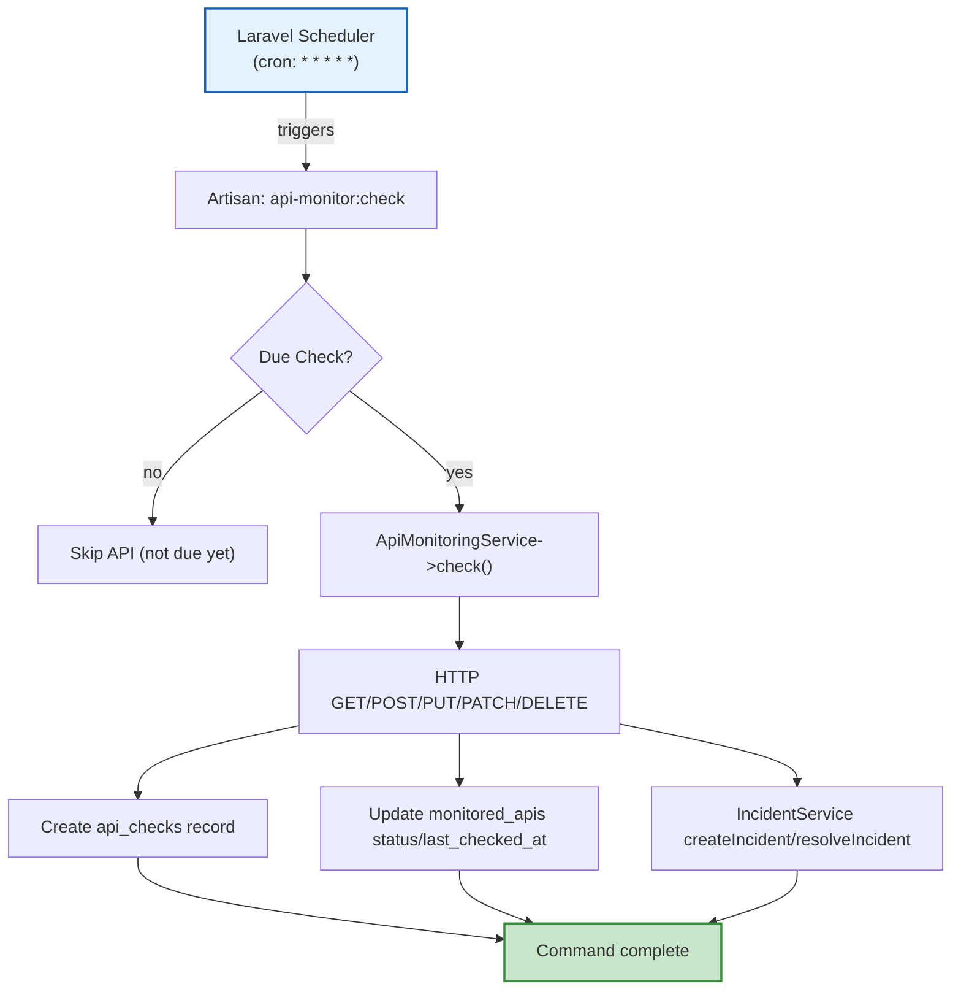
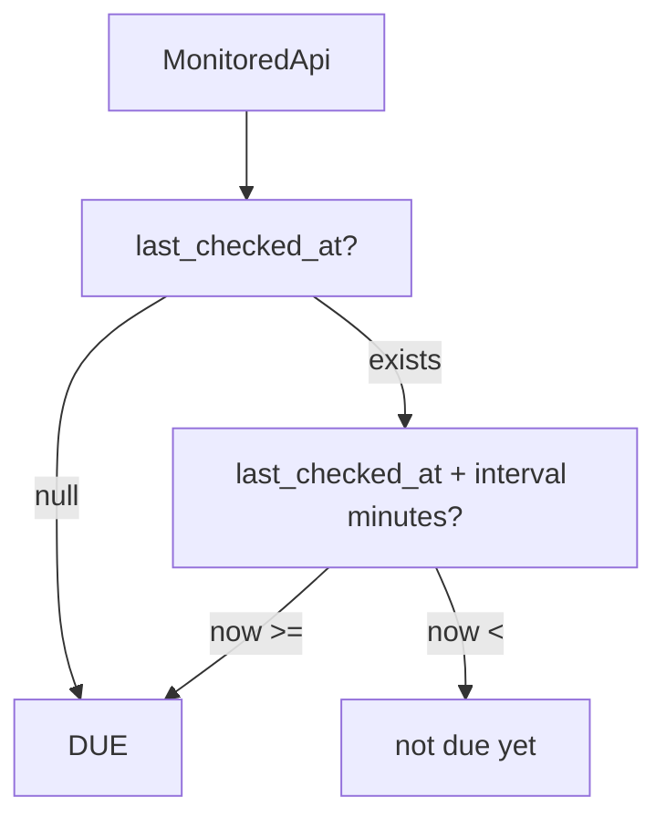

# API Monitor — Architecture Documentation

## Architecture Overview

The system follows a client-server pattern with a React frontend consuming a Laravel API. All monitoring logic resides in the Laravel backend, while the frontend provides visualization and user interaction.

```mermaid
flowchart TB
    direction LR
    React_Frontend -->|API calls| Laravel_API
    Laravel_API -->|PDO/Eloquent| MySQL
    
    subgraph "Backend Layer"
        L1[Routes (api.php)] --> L2[Controllers]
        L2 --> L3[Services]
        L3 --> L4[Models]
        L4 --> L5[Database]
    end
    
    subgraph "Frontend Layer"
        F1[React Components] --> F2[Axios Services]
        F2 -->|GET/POST| Laravel_API
    end
    
    style React_Frontend fill:#e3f2fd,stroke:#1565c0,stroke-width:2px
    style Laravel_API fill:#e8f5e9,stroke:#2e7d32,stroke-width:2px
    style MySQL fill:#fff3e0,stroke:#f57c00,stroke-width:2px
```

## Frontend Architecture

### Page Structure

| Page | Route | Key Components |
|---|---|---|
| Dashboard | `/dashboard` | Stats grid, API status table, recent activity |
| APIs | `/apis` | List table, create modal, Check Now per API |
| API Detail | `/apis/{id}` | Status badge, response time chart, check history, incidents, Check Now |
| Incidents | `/incidents` | Incident list with filtering, OPEN/RESOLVED display, duration |
| Settings | `/settings` | Placeholder (under development) |

### Core Services

| Service File | Purpose |
|---|---|
| `monitoredApiService.ts` | API CRUD, check, get incidents |
| `api.ts` | Axios instance (`http://127.0.0.1:8000/api`) |
| `ApiStatusBadge.tsx` | Status color badge component |

### State Management

- React `useState` for incidents, loading, error
- `useEffect` for data loading on page mount
- Router params (`useParams`) for API ID routing
- Local filtering and sorting in component logic

### Styling

- Tailwind CSS for utility styling
- Lucide React for icons (CheckCircle2, XCircle, Loader2, etc.)
- Custom components: `ApiStatusBadge`, `StatCard`

## Backend Architecture

### Directory Structure (app/)

```
app/
├── Http/           Controllers + Resources
├── Services/       ApiMonitoringService, IncidentService
├── Models/         MonitoredApi, ApiCheck, Incident, User, ApiHeader
├── Console/        Artisan commands (CheckMonitoredApis)
└── Http/Requests   StoreMonitoredApiRequest, UpdateMonitoredApiRequest
```

### Key Components

| Component | Responsibility |
|---|---|
| `ApiMonitoringService` | HTTP requests, status classification, api_checks creation, incident management |
| `IncidentService` | createIncident (duplicate check), findOpenIncident, resolveIncident, getIncidents, countOpenIncidents |
| `CheckMonitoredApis` | Artisan command `api-monitor:check`, due-check logic, iteration tracking |
| `MonitoredApiController` | Route handlers: index, show, store, update, destroy, check, checks |
| `IncidentController` | Route handlers: index, show |

### Request Flow

```
Client Request
    → routes/api.php
    → MonitoredApiController (or IncidentController)
    → Application Service (ApiMonitoringService or IncidentService)
    → Eloquent Model (query/update database)
    → Response (JSON via Resources or direct return)
    → Axios (frontend)
    → React Component (state update)
```

## Monitoring Architecture

### Scheduler Integration



### Due-Check Logic



### Status Classification Flow

```
HTTP Response
    ↓
Is 2xx? --no--> DOWN
    ↓
Is response < 1000ms? --no--> DEGRADED
    ↓
UP
```

## API Request Flow

### Manual Check (POST /api/apis/{id}/check)

```
1. Frontend: axios.post('/api/apis/{id}/check')
2. → Backend: MonitoredApiController@check()
3. → Service: app(ApiMonitoringService::class)->check($api)
4. → HTTP request to configured API URL
5. → Record api_checks (status, response_time, error_message)
6. → Update monitored_apis (status, response_time, last_checked_at)
7. → Incident detection (create/resolve)
8. → Return result to frontend
9. → Frontend: update UI state
```

### Automatic Check (Scheduler)

```
1. Cron: * * * * * → php artisan schedule:run
2. → Command: api-monitor:check
3. → Iterate all monitored_apis
4. → isDue() check per API
5. → Due APIs: ApiMonitoringService->check()
6. → Non-due APIs: skip with info log
7. → All results logged (due count, processed, skipped, errors)
```

## Error Handling

### Per-API Error Isolation

- Each API check runs in isolation
- Exception on one API does not affect other APIs
- Command continues loop even if one API fails
- Errors captured in `api_checks.error_message` and `monitored_apis` may show error status

### Try-Catch in Monitoring

```php
// ApiMonitoringService@check()
try {
    // HTTP request
} catch (\Exception $e) {
    $status = 'DOWN';
    $errorMessage = $e->getMessage();
    // Still creates api_checks record
    // Still updates monitored_apis
    // Still manages incidents (DOWN → create incident)
}
```

### Frontend Error Handling

- `try/catch` in `useEffect` data loading
- Error state set if fetch fails
- UI shows "Failed to load..." message
- Console error logged for developer debugging

## Directory Structure

```
api-monitor/
├── backend/              Laravel 12 application
│   ├── app/              PHP sources
│   │   ├── Models/       DB models
│   │   ├── Services/     Business logic
│   │   ├── Controllers/  HTTP handlers
│   │   └── Console/      Artisan commands
│   ├── routes/           API routes (api.php)
│   ├── database/         migrations
│   └── http/             controller resources
├── frontend/             React + TypeScript + Vite
│   ├── src/pages     UI pages
│   ├── src/services  API services (Axios)
│   ├── src/types     TypeScript types
│   ├── src/components UI components
│   └── src/assets    Static assets
├── docs/                 Project documentation
├── .gitignore
└── README.md
```

## Technology Decisions

| Decision | Rationale |
|---|---|
| **Laravel 12** | Rapid development, built-in scheduler, Eloquent ORM |
| **React + TypeScript** | Modern UI, type safety, strong ecosystem |
| **Tailwind CSS** | Utility-first, fast UI development, consistent theming |
| **Axios** | Standard HTTP client, interceptors, error handling built-in |
| **Laravel Scheduler** | Native cron integration, no extra queue infrastructure needed |
| **MySQL** | Widely available, sufficient for check history storage |
| **Lucide Icons** | Lightweight, consistent icon set, easy to import |
| **Recharts** | Simple charting for response time visualization |
| **No authentication (MVP)** | Faster initial development; authenticated endpoints can be added later |
| **No Redis/Horizon** | Synchronous checks suffice for MVP; queue infrastructure would add complexity |