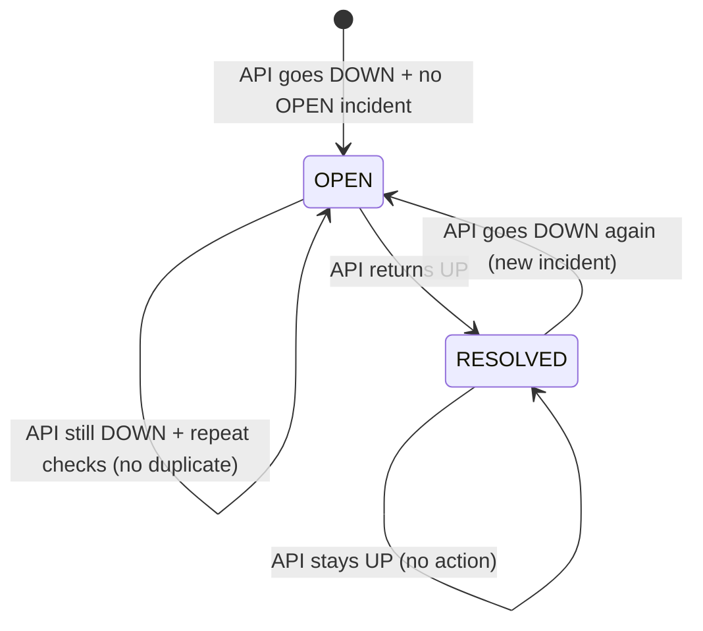

# API Monitor — Incident Management Documentation

## When Incident Is Created

An OPEN incident is created when an API check returns status `DOWN` and there is no existing OPEN incident for that API. This is handled by `IncidentService::createIncident()`.

### Creation Details

- **Trigger**: API status = DOWN after a check
- **Title**: `"{apiName} is down"` (e.g., "Production API is down")
- **Description**: The error message from the check (e.g., "HTTP 500" or the exception message)
- **started_at**: Set to `now()` (current timestamp)
- **status**: Set to `OPEN`
- **Duplicate prevention**: If an OPEN incident already exists for the API, `createIncident()` returns the existing incident and does not create a new one

## When Incident Is Resolved

An OPEN incident is resolved when an API check returns status `UP` and there is an existing OPEN incident for that API. This is handled by `IncidentService::resolveIncident()`.

### Resolution Details

- **Trigger**: API status = UP after a check
- **Action**: Find the OPEN incident for the API, set status to `RESOLVED`, set `resolved_at` to `now()`
- **Effect**: The incident is marked as resolved; `monitored_apis` status is updated to UP

## Status: OPEN vs RESOLVED

| Status | Meaning |
|---|---|
| **OPEN** | Incident is active; API is currently down or degraded |
| **RESOLVED** | Incident has been closed; API has recovered |

Incidents display their status with color coding:
- OPEN: Red badge/text (`text-red-600 bg-red-50`)
- RESOLVED: Emerald badge/text (`text-emerald-600 bg-emerald-50`)

## Duration Calculation

Duration is calculated based on the incident's `started_at` and `resolved_at`:

- **Open incident** (status = OPEN): Duration = current time - `started_at`
  - Less than 1 minute: `{X} min`
  - Less than 60 minutes: `{X}h {Y}m`
  - Less than 24 hours: `{X}h`
  - 24+ hours: `{X}d {Y}h`

- **Resolved incident** (status = RESOLVED, has both `started_at` and `resolved_at`): Duration = `resolved_at` - `started_at`
  - Same formatting as above

## Relationship Between Incident and Monitored API

- Each incident is linked to one `monitored_api_id`
- An API can have multiple incidents over time (if it goes down, recovers, goes down again)
- The `incidents` table has a foreign key `monitored_api_id` with cascade on delete
- When an API is deleted, its associated incidents are also deleted (cascade)

## API Endpoint: Incidents

| Method | Endpoint | Description |
|---|---|---|
| **GET** | `/api/incidents` | List all incidents, filterable by `?api_id` query parameter |
| **GET** | `/api/incidents/{incident}` | Show single incident detail |

### Incident List Filtering

- **All incidents**: `/api/incidents` (no filter)
- **By API**: `/api/incidents?api_id={id}`
- **OPEN incidents only**: Filter by status in the UI (Incidents page)
- **RESOLVED incidents only**: Filter by status in the UI (Incidents page)

### Incident Resource Fields

| Field | Type | Description |
|---|---|---|
| id | int | Unique incident ID |
| apiId | int | Linked monitored API ID |
| apiName | string | Name of the linked API |
| title | string | Incident title (e.g., "API is down") |
| status | string (OPEN/RESOLVED) | Current incident status |
| startedAt | ISO string | When the incident started |
| resolvedAt | ISO string (nullable) | When the incident was resolved |
| description | string (nullable) | Free-form description |

## Incident Lifecycle Diagram

