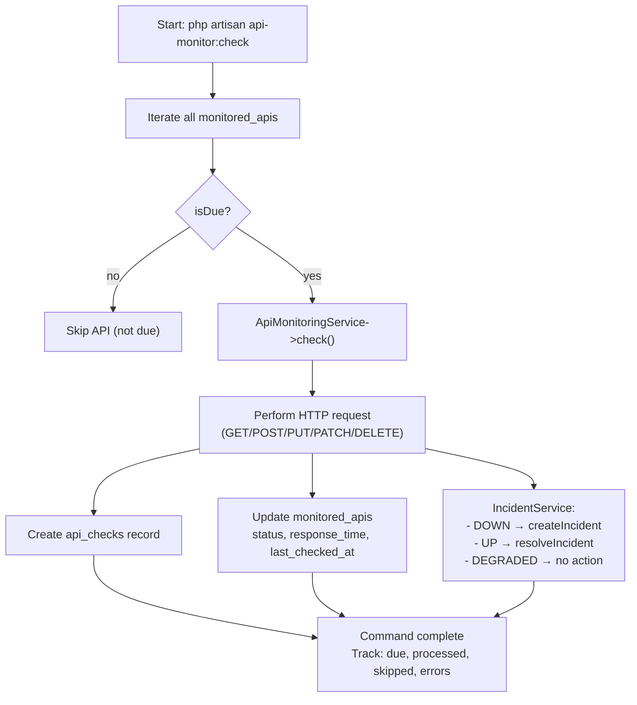

# API Monitor — Monitoring Engine Documentation

## How APIs Are Selected for Checking

The Laravel Scheduler triggers the `api-monitor:check` command every minute. The command iterates through all `monitored_apis` and checks each one's `isDue()` status based on the API's configured `interval` (in minutes) and the `last_checked_at` timestamp.

### Due-Check Logic

- If `last_checked_at` is `null` → API is DUE (never checked)
- If `last_checked_at` exists → Calculate `last_checked_at + interval minutes`
- If current time >= that calculated time → API is DUE
- If current time < that calculated time → API is NOT due, skipped

For due APIs, `ApiMonitoringService->check()` is executed. Non-due APIs are skipped with an info log.

## Timeout

Each API check uses the `timeout` value (in seconds) from the `monitored_apis` table, defaulting to 10 seconds. The Laravel Http client respects this timeout; if the request exceeds it, an exception is thrown and the check result is classified as `DOWN`.

## HTTP Methods

The system supports all major HTTP methods configured per API:

- **GET** (default)
- **POST**
- **PUT**
- **PATCH**
- **DELETE**

The `ApiMonitoringService` sends requests based on the `method` field on the `monitored_apis` table. All methods send an empty body for the MVP.

## Response Time

Response time is measured in milliseconds using `microtime(true)` before and after the HTTP request:

```php
$startTime = microtime(true);
// ... HTTP request ...
$responseTime = (microtime(true) - $startTime) * 1000;
$responseTime = round($responseTime);
```

The recorded response time is stored in `api_checks.response_time` and used to update `monitored_apis.response_time`. The status classification uses response time:

- **UP**: 2xx + response_time < 1000ms
- **DEGRADED**: 2xx + response_time >= 1000ms
- **DOWN**: non-2xx response or request exception

If a DOWN status has response_time >= 1000ms, the status is upgraded to DEGRADED.

## Status Classification

The `ApiMonitoringService` determines the final status based on HTTP response:

| Condition | Status |
|---|---|
| Exception thrown (timeout, connection failed) | DOWN |
| Non-2xx HTTP status code (4xx, 5xx) | DOWN |
| 2xx + response_time < 1000ms | UP |
| 2xx + response_time >= 1000ms | DEGRADED |

**Priority flow:**
1. If exception → DOWN
2. If non-2xx → DOWN
3. If 2xx + response_time >= 1000ms → DEGRADED
4. If 2xx + response_time < 1000ms → UP

## api_checks Table

One record is created per check with:
- `monitored_api_id`: links to the monitored API
- `status`: UP/DEGRADED/DOWN
- `status_code`: HTTP response code (nullable, null for exceptions)
- `response_time`: milliseconds (nullable, 0 for exceptions before response)
- `error_message`: error description (nullable)
- `checked_at`: timestamp of when the check was performed

## monitored_apis Update

After each check, the `monitored_apis` table is updated:
- `status`: set to the new status (UP/DEGRADED/DOWN)
- `response_time`: set to the latest response time in ms
- `last_checked_at`: set to `now()`

## Incident Interaction

The monitoring service interacts with `IncidentService` after each check:

- **Status = DOWN**: Calls `createIncident(api, title, description)` if no OPEN incident exists for the API. If an OPEN incident already exists, the existing one is returned (no duplicate).
- **Status = UP**: Calls `resolveIncident(api)` to mark any OPEN incident as RESOLVED and set `resolved_at`.
- **Status = DEGRADED**: No incident action; incident status remains unchanged.

## Scheduler

The `api-monitor:check` Artisan command is the core of automatic monitoring. It:

1. Iterates all `monitored_apis`
2. Checks `isDue()` per API based on `interval` and `last_checked_at`
3. For due APIs, runs `ApiMonitoringService->check()`
4. Non-due APIs are skipped with an info log
5. Tracks and logs counts: due, processed, skipped (not due), errors
6. Each check performs HTTP request, records `api_checks`, updates `monitored_apis`, manages incidents

### Manual Check

Manual checks are triggered via `POST /api/apis/{id}/check` (from frontend or API client). The flow is identical to the automatic check:

1. Frontend calls `axios.post('/api/apis/{id}/check')`
2. Backend: `MonitoredApiController@check()`
3. Service: `app(ApiMonitoringService::class)->check($api)`
4. HTTP request to configured API URL
5. Record `api_checks`, update `monitored_apis`, manage incidents
6. Return result to frontend

## Monitoring Flowchart

