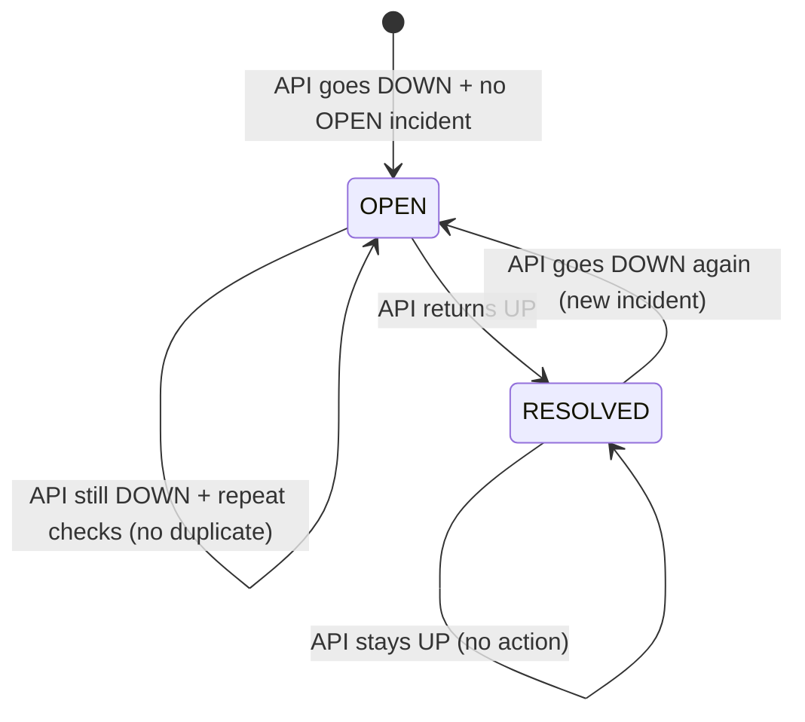

# API Monitor — Product Requirements Document

## 1. Product Overview

API Monitor is a web application for monitoring the health and performance of APIs. Users can configure API endpoints to be monitored automatically on a schedule or check them manually. The system tracks response times, uptime, classifies status as UP/DEGRADED/DOWN, maintains check history, and manages incidents when APIs go down.

## 2. Problem Statement

Without API monitoring, teams lose visibility into service availability. Issues go undetected until users report them. There is no centralized way to track response times, uptime percentages, or historical performance. When APIs fail, there is no systematic way to track downtime, create alerts, or ensure follow-up resolution.

## 3. Goals

- Provide a unified dashboard to monitor all configured APIs
- Automatically check APIs at scheduled intervals without manual intervention
- Classify API health into three states: UP, DEGRADED, DOWN
- Track response times and calculate uptime percentages
- Detect and manage incidents when APIs go down
- Prevent duplicate incidents for the same API
- Resolve incidents automatically when APIs recover
- Allow manual check-on-demand for immediate testing
- Maintain a full history of all checks for auditing and analysis
- Provide a clear, intuitive UI for both technical and non-technical users

## 4. Non-Goals

- Authentication and authorization (Sanctum is present but not configured for access control)
- Background job processing with queues (checks run synchronously via scheduler)
- Redis or Horizon for caching/queuing
- Advanced analytics or machine learning predictions
- Multi-tenant data isolation (all APIs currently share the same monitored_apis table)
- Real-time webSocket updates (polling used instead)
- Docker containerization (manual deployment required)

## 5. Target Users

- DevOps engineers responsible for service reliability
- Backend developers wanting to monitor API dependencies
- Product managers wanting uptime metrics
- SRE teams needing incident tracking
- QA teams validating API stability

## 6. User Stories

| ID | User Story |
|---|---|
| FR-001 | As a user, I want to add a new API so that I can monitor its availability |
| FR-002 | As a user, I want to manually check an API on demand |
| FR-003 | As a user, I want the system to automatically check APIs every minute |
| FR-004 | As a user, I want to see the current status (UP/DEGRADED/DOWN) of each API |
| FR-005 | As a user, I want to see response time and uptime statistics |
| FR-006 | As a user, I want to view check history for each API |
| FR-007 | As a user, I want to be notified when an API goes down |
| FR-008 | As a user, I want incidents to be automatically resolved when the API recovers |
| FR-008 | As a user, I want to see a summary of open and resolved incidents |
| FR-009 | As a user, I want to filter incidents by API and status |
| FR-010 | As a user, I want to see the uptime percentage over time |

## 7. Functional Requirements

### API Management
- FR-001: Create monitored API (name, URL, method, timeout, interval)
- FR-002: View list of monitored APIs with check counts
- FR-003: View single API detail with checks and incidents
- FR-004: Update API configuration
- FR-005: Delete API and related data

### Monitoring
- FR-003: Automatic check via Laravel Scheduler every minute
- FR-006: Manual check via POST `/api/apis/{id}/check`
- FR-006: Status classification: UP (2xx + response < 1s), DEGRADED (2xx + response >= 1s), DOWN (errors)
- FR-007: Response time recording in milliseconds
- FR-008: Uptime percentage calculation from check history

### Check History
- FR-006: View list of past checks per API
- FR-006: Each check records status, response time, error message, checked_at

### Incident Management
- FR-007: OPEN incident created when API status = DOWN and no OPEN incident exists
- FR-007: No duplicate OPEN incident created if one already exists
- FR-007: Incident resolved when API status = UP
- FR-008: New incident created after prior incident is RESOLVED and API goes DOWN again
- FR-008: INCIDENTS page lists all incidents with filtering by status and API
- FR-008: Incidents display API name, title, status, started_at, resolved_at, duration

### Dashboard
- Stats: Total APIs, Operational (UP), Down, Uptime percentage
- Recent activity list with status icons
- Quick navigation to APIs and incidents

### Scheduler
- FR-003: `api-monitor:check` runs every minute via Laravel Scheduler
- Due APIs checked based on their configured interval
- Non-due APIs skipped without checking

### Non-Functional Requirements

- **Performance**: Check execution should complete within 5-10 seconds per API
- **Reliability**: Errors on one API should not prevent checking of others
- **Maintainability**: Code follows Laravel conventions; services separated from controllers
- **Security**: No authentication currently; CORS configured for development origins
- **Scalability**: Designed for moderate number of monitored APIs (tested with small sets)

## 8. System Workflow

```mermaid
flowchart TD
    direction TB
    subgraph "Scheduler Loop"
        S1[php artisan schedule:work] -->|every minute| S2[api-monitor:check command]
        S2 --> S3{Iterate monitored_apis}
        S3 --> S4{isDue?}
        S4 -- no --> S5[skip API]
        S4 -- yes --> S6[ApiMonitoringService->check()]
        S6 --> S7[HTTP request to API]
        S7 --> S8[record api_checks]
        S7 --> S9[update monitored_apis status/last_checked_at]
        S7 --> S10[incident detection]
        S10 -- DOWN --> S11[create/open incident]
        S10 -- UP --> S12[resolve OPEN incident]
        S10 -- DEGRADED --> S13[no incident action]
        S11 --> S14[api_checks created]
        S12 --> S15[incident status = RESOLVED]
        S14 & S15 --> S16[monitored_apis updated]
    end
```

## 9. Status Logic

### UP
- HTTP response status in 2xx range
- Response time < 1000ms (1 second)
- Example: `GET http://example.com/health` returns 200 in 124ms → **UP**

### DEGRADED
- HTTP response status in 2xx range
- Response time >= 1000ms (1 second)
- Example: `GET http://example.com/slow` returns 200 in 1800ms → **DEGRADED**

### DOWN
- HTTP response is a server error (5xx) or client error (4xx)
- OR request threw an exception (connection failed, timeout, etc.)
- Example: `GET http://nonexistent.example.com` → **DOWN**

### Classification Priority
1. If exception thrown → DOWN
2. If non-2xx response → DOWN
3. If 2xx + response >= 1s → DEGRADED
4. If 2xx + response < 1s → UP

## 10. Incident Lifecycle



### States and Transitions

| Transition | Condition | Behavior |
|---|---|---|
| **DOWN → Incident Created** | API status = DOWN + no OPEN incident | `createIncident()` called; title = "{apiName} is down"; started_at = now |
| **DOWN → No Duplicate** | API status = DOWN + OPEN incident already exists | `createIncident()` returns existing incident; no new record |
| **DOWN → RESOLVED** | API status = UP + OPEN incident exists | `resolveIncident()` called; status = RESOLVED; resolved_at = now |
| **RESOLVED → New Incident** | API status = DOWN + prior incident = RESOLVED | New incident created; old incident stays RESOLVED; total incidents incremented |
| **UP → No Action** | API status = UP + no OPEN incident | `resolveIncident()` returns null; no change |
| **DEGRADED → No Action** | API status = DEGRADED | No incident creation or resolution |

## 11. Data Model

```mermaid
erDiagram
    USERS |--|{ MONITORED_APIS : "owns"
    MONITORED_APIS ||--|{ API_CHECKS : "many check records"
    MONITORED_APIS ||--|{ INCIDENTS : "many incidents"
    MONITORED_APIS ||--|{ API_HEADERS : "many header configs"
    
    API_CHECKS ||--|{ INCIDENTS : "triggered by checks (logical)"
```

## 12. API Requirements

| Method | Endpoint | Purpose | Auth |
|---|---|---|---|
| GET | /api/apis | List all monitored APIs | None |
| POST | /api/apis | Create new API | None |
| GET | /api/apis/{id} | Show API detail | None |
| PUT | /api/apis/{id} | Update API | None |
| DELETE | /api/apis/{id} | Delete API | None |
| POST | /api/apis/{id}/check | Manual check now | None |
| GET | /api/apis/{id}/checks | Get check history | None |
| GET | /api/incidents | List all incidents | None |
| GET | /api/incidents/{id} | Show single incident | None |

## 13. UI Requirements

The following pages are available:

- **Dashboard** (`/dashboard`): Overview stats, recent activity, navigation
- **APIs** (`/apis`): List, create, edit monitored APIs; Check Now button
- **API Detail** (`/apis/{id}`): Status badge, response time chart, check history, incidents, Check Now
- **Incidents** (`/incidents`): List of incidents with filtering, OPEN/RESOLVED display, duration
- **Settings** (`/settings`): Currently a placeholder page

## 14. Acceptance Criteria

The following must pass for Step 10 completion:

- **A**: UP without OPEN incident → no TypeError, no incident created
- **B**: DOWN → API DOWN creates exactly ONE OPEN incident
- **C**: DOWN → DOWN → repeated checks do NOT create duplicate OPEN incidents
- **D**: DOWN → UP → OPEN incident becomes RESOLVED
- **E**: RESOLVED → DOWN → new incident created (old incident stays RESOLVED)
- **F**: UP → UP → no new incident, no error

All runtime tests must pass without crashes.

## 15. Future Enhancements

These features are identified for future development but are **not implemented** in the current codebase:

- Authentication with Sanctum guards and API tokens
- Background queue processing for checks (currently synchronous)
- Redis caching for improved performance
- Notification systems (email, Slack, webhook)
- Docker deployment scripts

---

*Product Requirements Document — API Monitor*